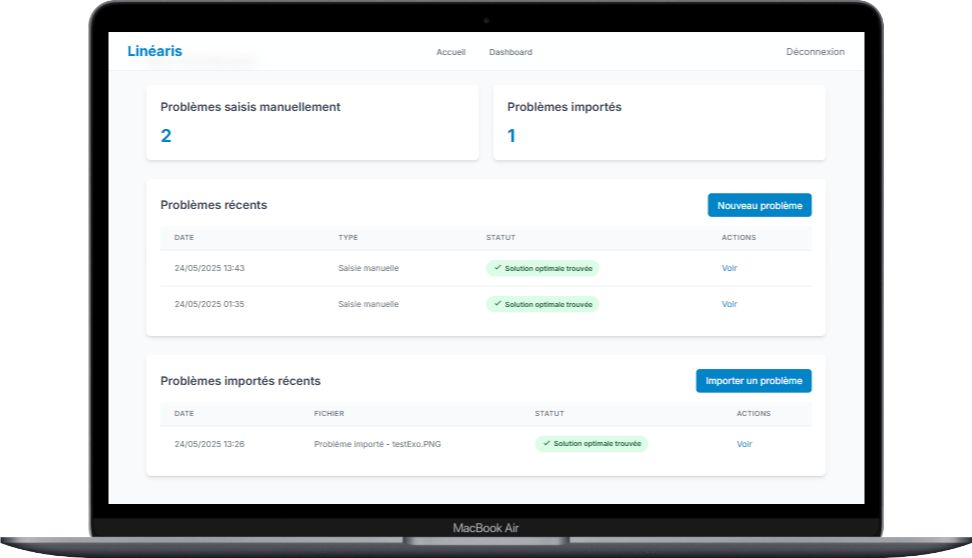
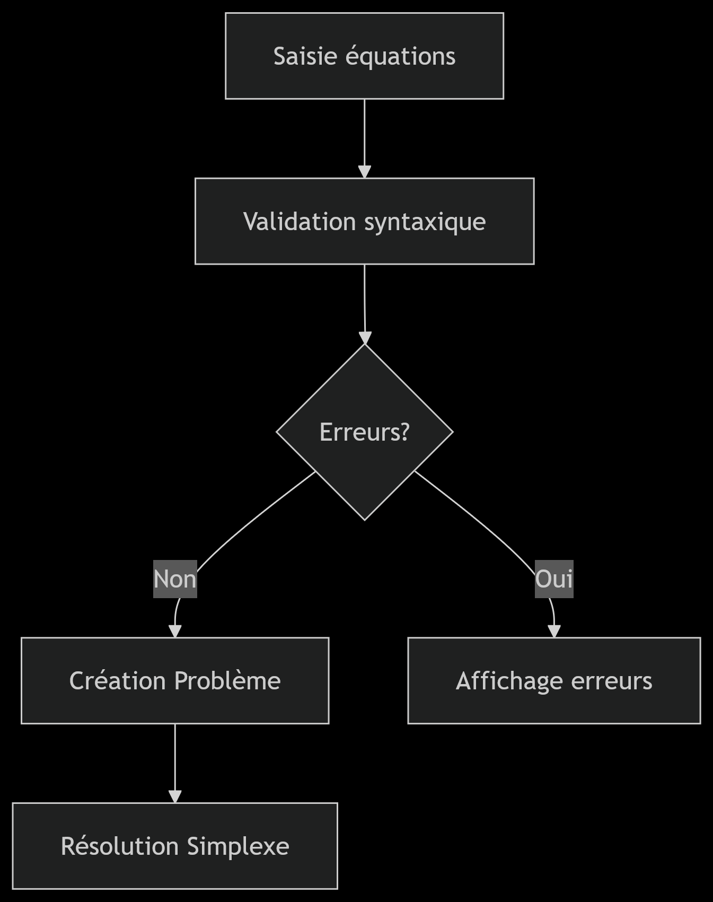
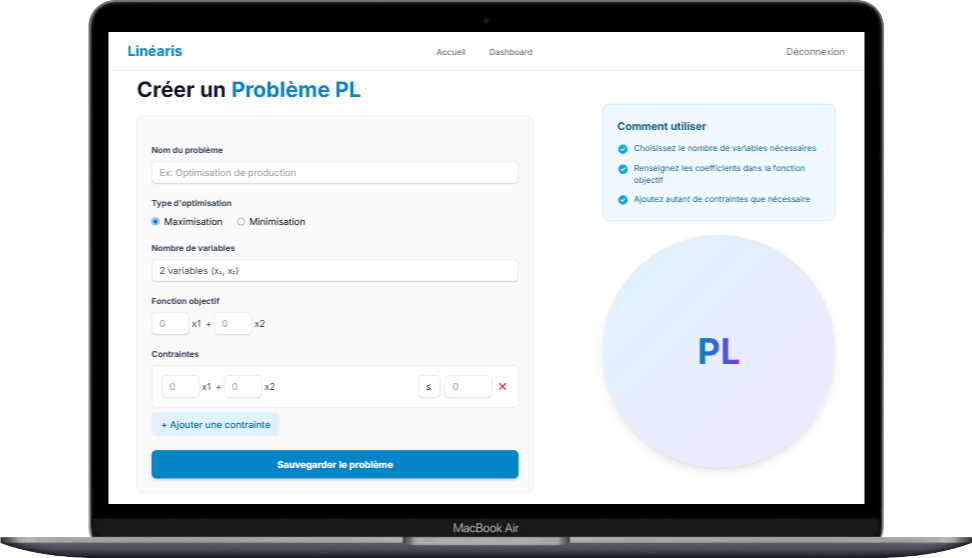
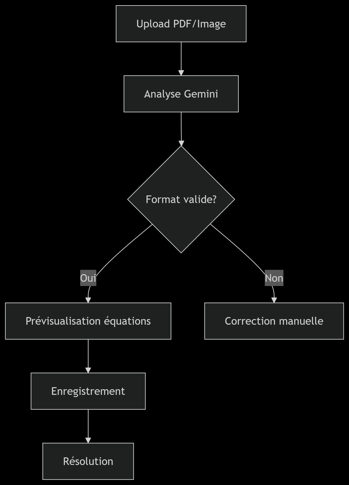
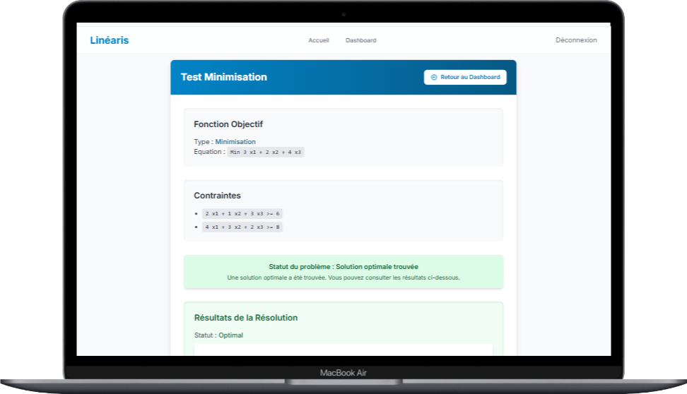
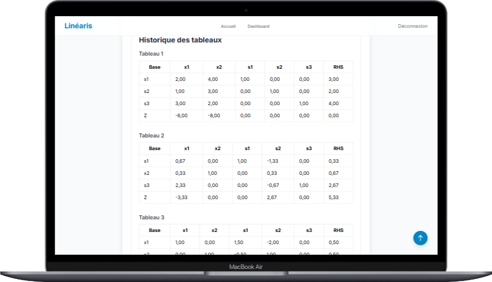

# Linéaris - Solveur de Programmation Linéaire Intelligente



## 🎯 Objectif
Outil éducatif pour résoudre des problèmes de programmation linéaire (PL), conçu pour :
- **Étudiants** : Apprendre le Simplexe via des itérations visualisées  
- **Enseignants** : Créer des exemples pédagogiques  
- **Chercheurs** : Prototyper rapidement des modèles d'optimisation  

## ✨ Fonctionnalités Actuelles
| Fonctionnalité | Description |
|----------------|-------------|
| **Saisie Manuelle** | Interface équations avec validation en temps réel 
| **Import IA** | Extraction de PL depuis PDF/images via Gemini |
| **Résolution Simplexe** | Historique complet des tableaux d'itérations |
| **Gestion des Problèmes** | Sauvegarde/chargement dans l'espace utilisateur |

## 🛠️ Stack Technique
```python
# Core Stack
Django 4.2         # Framework web
Gemini 1.5 Flash   # Extraction IA des équations
NumPy 2.0          # Calculs matriciels pour Simplexe
PyPDF2/Pillow      # Traitement PDF/images

# Modèles Clés (models.py)
Problem            # Stocke les données PL complètes
ImportedProblem    # Gère les problèmes importés (+métadonnées)
```

## 🚀 Installation Rapide

### 1. Cloner le dépôt

```bash
git clone https://github.com/votre-repo/linearis.git
cd linearis
```

### 2. Configurer l'environnement

```bash
python -m venv venv
source venv/bin/activate  # Linux/Mac
venv\Scripts\activate     # Windows
```

### 3. Installer les dépendances

```bash
pip install -r requirements.txt
```
### 4. Configurer Gemini (obtenir une clé API)

```bash
echo "GEMINI_API_KEY='votre_cle_api'" > .env
```

### 5. Lancer le serveur

```bash
python manage.py migrate
python manage.py runserver
```

#### ➔ Accédez à http://localhost:8000


## 📚 Workflows Clés

### 1. Saisie Manuelle





### 2. Import IA




### 3. Visualisation de la solution optimal





## 🏗 Architecture du Projet

```
linearis/
├── problems/          # Module cœur
│   ├── services.py    # Intégration Gemini
│   ├── simplex.py     # Implémentation Simplexe
│   ├── models.py      # Modèles de données
│   └── views.py       # Logique métier
├── templates/         # Interfaces utilisateur
│   ├── problems/      # Pages spécifiques PL
│   └── users/         # Gestion de compte
└── linearis_project/  # Configuration Django
```

## ⚠ Limitations Actuelles

- **Simplexe** : Limité aux problèmes avec contraintes ≤ (max) ou ≥ (min)

- **Visualisation** : Pas de graphique 2D (en développement)

- **Performance** : Max ~5 variables/contraintes


## 🤝 Contribution

Les contributions sont bienvenues ! Étapes :

1. Fork du dépôt

2. Création d'une branche (feat/nouvelle-fonctionnalite)

3. Soumettre une Pull Request

